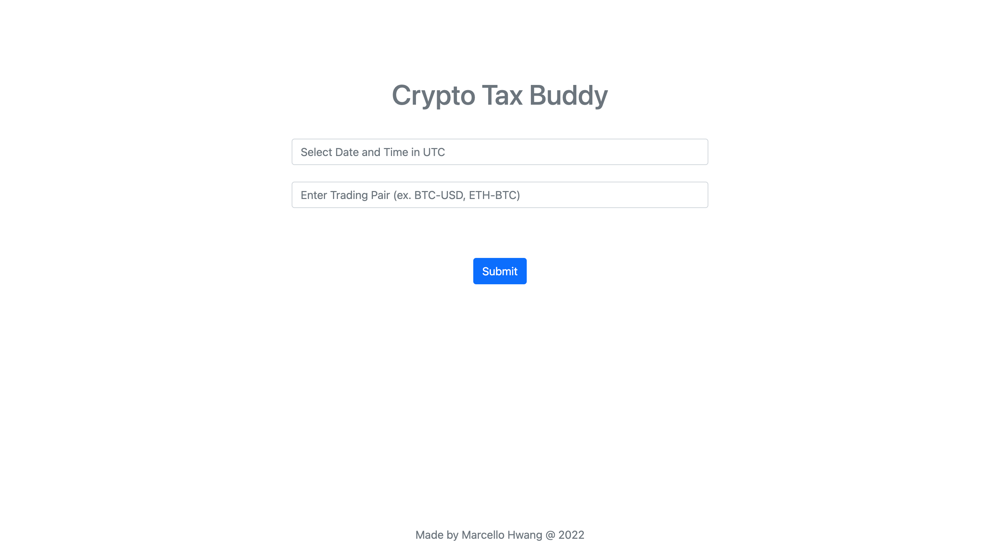
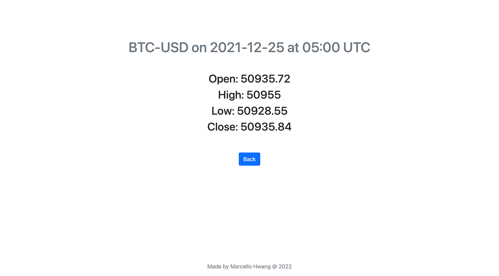

# Crypto Tax Buddy 

A Flask web app that provides historical 1-minute OHLC data for a cryptocurrency trading pair at a specified date and time by calling Coinbase Pro's API. This project originally started as a command line program in Java that used the Spring REST client to retrieve account balances and 1-minute OHLC data. I then made the same CLI application using Python, after which I created a simple web app with front-end using simple HTML, CSS, and JavaScript. Source for original CLI applications - https://github.com/hmh24/crypto_tax_buddy_cli

 

  

  

